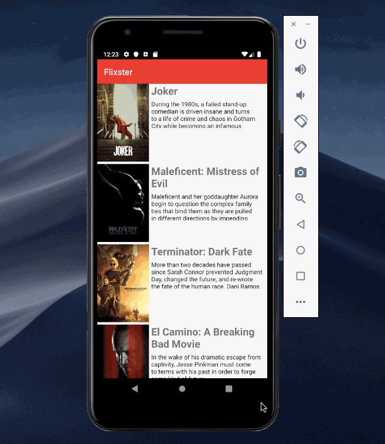
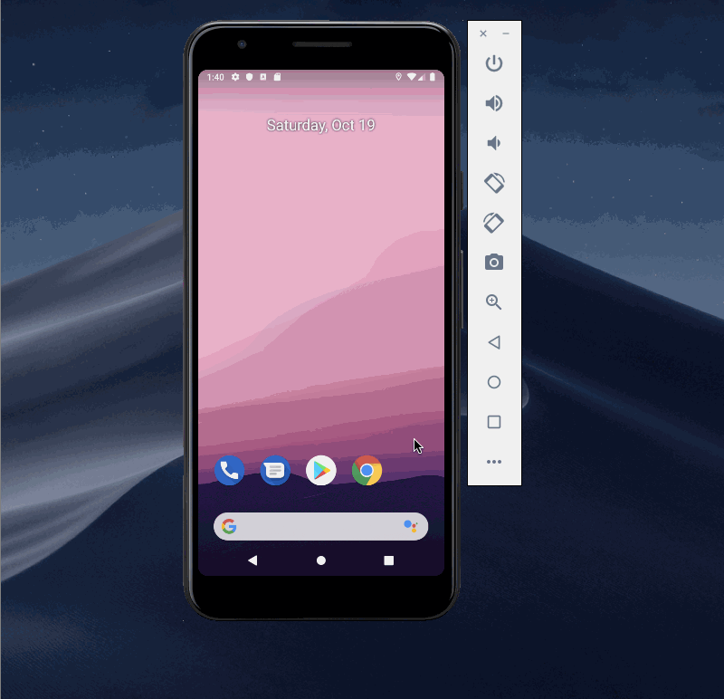

## Flix
- User can view a list of movies (title, poster image, and overview) currently playing in theaters from the Movie Database API.
- Views should be responsive for both landscape/portrait mode.
- Expose details of movie (ratings using RatingBar, popularity, and synopsis) in a separate activity.
- Allow video posts to be played in full-screen using the YouTubePlayerView.

### App Walkthough GIF

 

 

### Open-source libraries used

- [Android Async HTTP](https://github.com/codepath/CPAsyncHttpClient) - Simple asynchronous HTTP requests with JSON parsing
- [Glide](https://github.com/bumptech/glide) - Image loading and caching library for Androids
